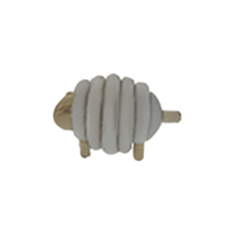

# ConsistNet: Enforcing 3D Consistency for Multi-view Images Diffusion


ConsistNet is a multi-view consistency plug-in block for latent diffusion models to improve 3D consistency.

Given one reference image, it can generate 16 multi-view consistent images in just 40 seconds on an A100 GPU.

[Paper](https://arxiv.org/abs/2310.10343) | [Project Page](https://jiayuyang.github.io/Consist_Net/)


## Plan

- [ ] Inference Code
- [ ] Pretrained Model
- [ ] Live Demo
- [ ] Training Code

## Pretrained Model

Coming soon!

## More Examples





## Citation
If you find this project useful for your project, please cite: 
```
@article{yang2023consistnet,
        title={ConsistNet: Enforcing 3D Consistency for Multi-view Images Diffusion},
        author={Yang, Jiayu and Cheng, Ziang and Duan, Yunfei and Ji, Pan and Li, Hongdong},
        journal={arXiv},
        year={2023}
    }

```